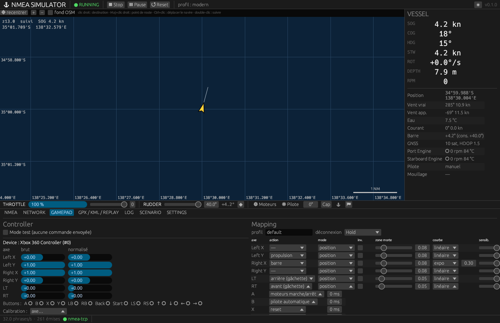

# Manette

La manette est une **source d'entrée de premier niveau** : elle émet les mêmes
commandes de l'API de contrôle que le clavier, l'interface et l'API HTTP. Elle
n'écrit jamais dans l'état du navire et ne produit jamais de phrase NMEA.



## Détection

Toute manette reconnue par le système (XInput, DualShock/DualSense, 8BitDo,
génériques HID) est détectée **à chaud** : branchement et débranchement sont
signalés, plusieurs manettes peuvent être connectées et chacune porte son
identifiant dans la source des commandes (`gamepad(n)`).

Sous Linux, l'accès aux périphériques `/dev/input/event*` est accordé à
l'utilisateur de la session par udev (`uaccess`). Si aucune manette
n'apparaît, vérifier `ls -l /dev/input/by-id/` et les droits.

## Mapping par défaut

| Entrée | Action | Commande |
|---|---|---|
| Stick gauche Y | propulsion, haut = avant | `propulsion.throttle.set` |
| Stick droit X | barre ±40° (courbe expo 0,3) | `helm.rudder.set` |
| LT | marche arrière, analogique | `propulsion.throttle.set` (négatif) |
| RT | marche avant, analogique | `propulsion.throttle.set` |
| A | moteurs marche / arrêt | `propulsion.engine.toggle` |
| B | pilote automatique | `autopilot.toggle` |
| X | reset | `sim.reset` |
| Y | mouillage | `anchor.toggle` |
| Croix ← / → | barre ±1°, répétée | `helm.rudder.nudge` |
| Croix ↑ / ↓ | propulsion ±10 %, répétée | `propulsion.throttle.nudge` |
| LB / RB | cap du pilote ±10° | `nav.heading.nudge` |
| Start | pause | `sim.togglePause` |
| Back | barre au centre | `helm.rudder.center` |
| LS / RS (clic) | marquer la position / point suivant | `route.mark`, `route.waypoint.next` |

Les gâchettes se combinent : propulsion = RT − LT.

## Traitement d'un axe

Dans l'ordre : **calibration** (min, centre, max mesurés) → **inversion** →
**zone morte** (rééchelonnée, sans saut à la frontière) → **courbe**
(linéaire, expo `(1−k)x + kx³`, puissance) → **sensibilité** (×0,1 à ×2).

Mode **position** : la position de l'axe est la consigne ; une commande n'est
émise que si la valeur change de plus de 0,5 % ; à l'entrée dans la zone
morte, une seule commande « zéro » est envoyée. Un stick au repos ne contredit
donc jamais le clavier.

Mode **taux** : la position de l'axe est une vitesse de variation (par exemple
un stick qui fait tourner le cap du pilote de *n* °/s).

## Onglet GAMEPAD

- liste des manettes, valeurs **brutes** et **normalisées** de chaque axe,
  état des boutons, dernières commandes émises ;
- **Mode test** : les entrées sont affichées, aucune commande n'est envoyée ;
- **Calibration** : choisir l'axe, amener le stick au repos puis « Centre »,
  le promener sur toute sa course puis « Valider l'amplitude » ;
- **Mapping** : action, mode, inversion, zone morte, courbe, sensibilité,
  échelle pour chaque axe ; action et répétition pour chaque bouton ;
- **Appliquer et enregistrer** : le profil est actif immédiatement et écrit
  dans la configuration ; **Exporter / Importer** : fichier JSON.

## Profil (JSON)

```json
{
  "schema": 1,
  "name": "default",
  "fingerprint": "*",
  "onDisconnect": "hold",
  "epsilon": 0.005,
  "axes": {
    "leftY":  { "action": "throttle", "mode": "position", "deadzone": 0.08,
                "curve": { "type": "linear" }, "sensitivity": 1.0, "scale": 1.0,
                "invert": false, "calibration": { "min": -1, "center": 0, "max": 1 } },
    "rightX": { "action": "rudder", "mode": "position", "deadzone": 0.08,
                "curve": { "type": "expo", "k": 0.3 }, "scale": 40.0 }
  },
  "buttons": {
    "south": { "action": { "type": "toggleEngines" }, "repeatMs": 0 }
  }
}
```

`onDisconnect: "center"` remet barre et propulsion au neutre si la manette est
débranchée ; `"hold"` (défaut) conserve les consignes.

## Tester sans manette

`tools/gamepad/virtual_pad.py` crée une manette Xbox 360 virtuelle (uinput,
sans dépendance) et joue une séquence A, RT, sticks, B, Y. Avec
`cargo run -p nmeasim-app --example gamepad_probe`, elle vérifie toute la
chaîne evdev → udev → gilrs → mapping → API sans matériel.
