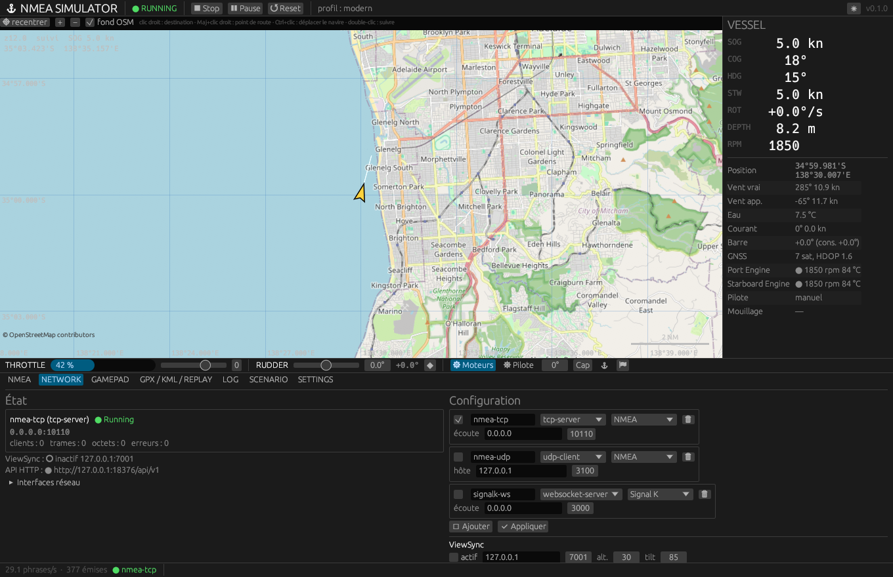

# Réseau



## Transports

Chaque transport a un identifiant, un état, un **format** (NMEA ou Signal K) et
une spécification. Plusieurs transports fonctionnent en même temps depuis le
même état. Ils s'ouvrent au démarrage de la simulation (ou à l'ouverture d'un
rejeu) et se ferment à l'arrêt.

| Type | Legacy | Champs | Comportement |
|---|---|---|---|
| `websocket-server` | 0 | `bind`, `port` | un message texte par phrase (CRLF inclus) ou par delta ; hello Signal K à la connexion |
| `tcp-server` | 1 | `bind` (`0.0.0.0` par défaut), `port` | plusieurs clients ; une écriture par phrase, CRLF ; hello Signal K à la connexion ; un client trop lent est déconnecté |
| `tcp-client` | 2 | `host`, `port` | reconnexion automatique (0,5 s à 10 s) ; état `reconnecting` visible |
| `serial` | 3 | `port`, `baudRate`, `dataBits`, `stopBits`, `parity`, `flowControl` | CRLF ; reprise après débranchement ; les lignes reçues vont au moniteur |
| `udp-broadcast` | 4 | `interface`, `port` | adresse de diffusion de l'interface (comme 1.6.1) |
| `udp-client` | 5 | `host`, `port` | unicast, un datagramme par phrase |
| `udp-multicast` | 6 | `group`, `port`, `interface`, `ttl` (128), `loopback` | un datagramme par phrase |

États : `stopped`, `starting`, `running` (seulement après un bind réussi ou une
connexion établie), `reconnecting`, `failed` (avec la dernière erreur).
Compteurs : clients, trames, octets, erreurs.

Exemple :

```json
"transports": [
  { "id": "nmea-tcp", "type": "tcp-server", "bind": "0.0.0.0", "port": 10110, "format": "nmea" },
  { "id": "opencpn",  "type": "udp-client", "host": "192.168.1.20", "port": 10110, "format": "nmea" },
  { "id": "sk",       "type": "websocket-server", "port": 3000, "format": "signalk" },
  { "id": "mcast",    "type": "udp-multicast", "group": "239.192.0.1", "port": 60001, "ttl": 1 },
  { "id": "gps-usb",  "type": "serial", "port": "/dev/ttyUSB0", "baudRate": 4800 }
]
```

## NMEA 0183

| Phrase | Talker | Contenu |
|---|---|---|
| RMC | GP | heure UTC, statut, position, SOG, COG, date, mode `A` |
| VHW | II | cap vrai et magnétique, STW (kn, km/h) |
| VTG | GP | COG vrai et magnétique, SOG (kn, km/h) |
| HDT / HDM | II | cap vrai / magnétique |
| ROT | TI | taux de giration, °/min |
| GLL / GGA | GP | position ; qualité, satellites, HDOP, altitude |
| GSA / GSV | GP | satellites utilisés, DOP ; satellites visibles |
| ZDA | GP | date et heure UTC, fuseau (`-hh,mm` / `hh,mm`) |
| VBW | II | vitesses longitudinales et transversales eau / fond |
| !AIVDO / !AIVDM | AI | AIS type 1 (position) et type 5 (identité, 2 fragments) |
| MWD / MWV | WI | vent vrai ; vent apparent relatif |
| MTW / DPT / DBT | II / SD | température d'eau ; profondeur (pieds, mètres, brasses) |
| WPL | IN | waypoint marqué |
| RPM | II | régime et pas d'hélice, par moteur |
| APB / RMB | II / GP | guidage vers la destination (`V` sans route) |

Préfixe IEC 61162-450 (`\c:<s>,s:nmeasim*CS\`) optionnel, appliqué aussi aux
phrases du terminal. Le profil legacy émet les 24 phrases de 1.6.1 dans leur
ordre ; `output.nmea.sentences` choisit la liste et l'ordre.

## Signal K

Hello : `{"name":"nmea-simulator","version":"<version>","self":"vessels.<id>","roles":["master","main"],"timestamp":…}`.

Delta par tick : `{"context":"vessels.<id>","updates":[{"timestamp":…,"$source":"nmea-simulator","values":[{"path":…,"value":…}]}]}`.
Chemins : `navigation.courseOverGroundTrue`, `headingTrue`, `headingMagnetic`,
`speedOverGround`, `speedThroughWater`, `rateOfTurn`, `position`,
`gnss.*`, `environment.wind.*`, `environment.water.temperature`,
`environment.depth.belowTransducer`, `environment.current`,
`steering.rudderAngle`, `propulsion.<p0|p1>.*`, `navigation.anchor.state`,
`navigation.destination.*`, `navigation.courseGreatCircle.*`. Unités SI
(m/s, radians, kelvins).

## ViewSync

Google Earth : `counter,lat,lon,altitude,heading,tilt,roll,timeStart,timeEnd,`
en UDP vers `viewsync.host:port` (127.0.0.1:7001 par défaut). `timeEnd` vaut
`timeStart + intervalle`.

## API HTTP

Activée par `--api [port]` ou `api.enabled` ; écoute `127.0.0.1` par défaut ;
jeton facultatif (`Authorization: Bearer <jeton>`).

| Méthode | Route | Effet |
|---|---|---|
| POST | `/api/v1/commands` | exécute une commande (`200`, `422` si refusée, `400` si invalide) |
| GET | `/api/v1/state` | instantané de la simulation |
| GET | `/api/v1/status` | instantané, transports, source active, débit |
| GET | `/api/v1/transports` | états des transports |
| GET | `/api/v1/paths` | chemins écrivables et bornes |
| GET | `/api/v1/monitor?since=N` | lignes du moniteur postérieures à `N` |
| POST | `/api/v1/replay` | commande de rejeu (`{"cmd":"play"}`…) |

Exemples :

```bash
curl -X POST localhost:8375/api/v1/commands -d '{"kind":"sim.start"}'
curl -X POST localhost:8375/api/v1/commands -d '{"kind":"propulsion.throttle.set","engine":"all","value":0.6}'
curl -X POST localhost:8375/api/v1/commands -d '{"kind":"helm.rudder.set","deg":10}'
curl -X POST localhost:8375/api/v1/commands -d '{"kind":"route.destination.set","position":{"lat":-35.1,"lon":138.4}}'
curl -X POST localhost:8375/api/v1/commands -d '{"kind":"autopilot.set","mode":"route"}'
curl -X POST localhost:8375/api/v1/commands -d '{"kind":"value.set","path":"env.wind.speedTrue","value":25}'
curl localhost:8375/api/v1/state
```

Commandes disponibles (`kind`) : `sim.start`, `sim.stop`, `sim.pause`,
`sim.resume`, `sim.togglePause`, `sim.reset`, `helm.rudder.set`,
`helm.rudder.nudge`, `helm.rudder.center`, `propulsion.throttle.set`,
`propulsion.throttle.nudge`, `propulsion.engine.set`,
`propulsion.engine.toggle`, `nav.heading.set`, `nav.heading.nudge`,
`nav.speed.set`, `nav.speed.nudge`, `nav.position.set`,
`route.destination.set`, `route.destination.clear`, `route.set`,
`route.waypoint.add`, `route.waypoint.addAtVessel`, `route.waypoint.next`,
`route.mark`, `autopilot.set`, `autopilot.toggle`, `autopilot.heading.set`,
`anchor.set`, `anchor.toggle`, `value.set`, `override.set`,
`override.release`.
