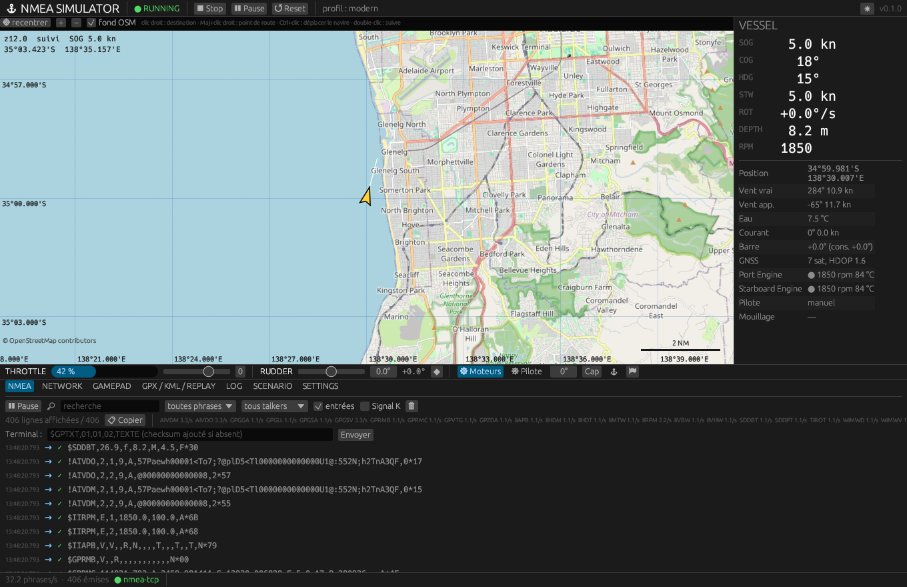

# Guide utilisateur

## 1. Premier lancement

```bash
nmeasim
```

La fenêtre s'ouvre, simulation **arrêtée**. Cliquer **▶ Start** (ou lancer
avec `--start`). Les transports configurés s'ouvrent au démarrage, comme dans
NMEASimulator 1.6.1 : par défaut, un serveur **TCP NMEA sur 0.0.0.0:10110**.

Brancher un client : OpenCPN (connexion réseau TCP, `127.0.0.1:10110`), un
ECDIS, ou simplement `nc 127.0.0.1 10110`.



## 2. La fenêtre

| Zone | Contenu |
|---|---|
| Barre du haut | état (RUNNING / PAUSED / STOPPED), Start, Stop, Pause, Reset, source active, enregistrement, profil |
| Carte | navire (orienté au cap), vecteur de route fond (1 minute), sillage, route, destination, trace chargée |
| VESSEL | SOG, COG, HDG, STW, ROT, profondeur, régime, position, vent, courant, barre, GNSS, moteurs, pilote, destination |
| Bandeau | propulsion (−100 % à +100 %), barre (consigne et angle réel), moteurs, pilote, cap, route, mouillage, marque |
| Onglets | NMEA, NETWORK, GAMEPAD, GPX / KML / REPLAY, LOG, SCENARIO, SETTINGS |
| Bas | débit de phrases, état des transports, message d'état |

L'interface **n'écrit jamais dans l'état du navire** : chaque action est une
commande de l'API de contrôle, comme celles du clavier, de la manette et de
l'API HTTP. Une commande refusée (hors bornes, trace en cours…) s'affiche en
bas de fenêtre et dans l'onglet LOG.

## 3. Piloter

### Modèle moderne (défaut)

- **Propulsion** : `−1` (arrière toute) à `+1` (avant toute). À l'équilibre,
  la vitesse vaut commande × vitesse maximale (12 nœuds par défaut, 4 en
  arrière). La vitesse monte et descend progressivement (inertie).
- **Moteurs** : sans moteur en marche, la propulsion n'a pas d'effet ; le
  navire ralentit. `A` sur la manette, `E` au clavier.
- **Barre** : la consigne est atteinte à 8 °/s. Le taux de giration suit la
  loi de rayons du legacy (600 m à 2°, 150 m à 20°) et décroît quand la barre
  revient à zéro.
- **Vent** : dérive sous le vent, vent apparent vectoriel.
- **Courant** : réglable dans SETTINGS ; SOG et COG s'écartent de STW et HDG.
- **Pilote automatique** : tenue du cap (bouton ⎈, `A`, B sur la manette) ou
  suivi de route. Toute action manuelle sur la barre le désengage.
- **Mouillage** : le navire s'immobilise.

### Profil legacy

Réglé dans SETTINGS → profil, ou `nmeasim --legacy`. La vitesse est commandée
directement (`↑`/`↓` ±1 nœud), la barre est instantanée et entière, le virage
s'arrête net à barre nulle, le bruit suit la formule `applySeed` de 1.6.1, et
les 24 phrases legacy sont émises dans leur ordre. Les **défauts** documentés
de 1.6.1 restent corrigés (voir `docs/04-compatibility-matrix.md`).

## 4. Route et destination

- **Clic droit** sur la carte : destination. `APB` et `RMB` passent en statut
  `A` et le Signal K publie la destination.
- **Maj + clic droit** : ajouter un point de route.
- **Route** (bandeau) : le pilote suit la route et passe au point suivant dans
  le cercle d'arrivée (100 m).
- **✖ route** efface la route.
- **⚑** marque la position (`WPL`).

## 5. Moniteur NMEA

Onglet **NMEA** : chaque ligne émise ou reçue, avec heure, sens (→ émise,
← reçue), validité du checksum (✓ / ✗). Pause, recherche, filtres par phrase
et par talker, copie des lignes filtrées, fréquence par phrase. Le
**terminal** envoie une phrase au prochain tick (le checksum est calculé s'il
manque ; le préfixe 61162-450 est ajouté s'il est actif).

## 6. Traces, rejeu, journal

Voir [scenarios.md](scenarios.md) pour les scénarios.

- **Charger une trace** (GPX ou KML) : le navire suit la trace dès que la
  simulation tourne, un point par tick ; en fin de trace la simulation
  s'arrête (« End of track has been reached. »), comme 1.6.1, sauf si
  « boucler » est coché.
- **Charger comme route** : les points deviennent la route du pilote.
- **Ouvrir un journal** `.nmeasim` : rejeu avec lecture, pause, pas à pas,
  vitesse et boucle. Pendant le rejeu, la simulation live ne produit rien.
- **Enregistrer** (onglet LOG) : journal `.nmeasim` avec ligne `meta:`
  (intervalle, graine, profil), relisible par 1.6.1.

## 7. Raccourcis clavier

| Touche | Action |
|---|---|
| `↑` / `↓` | propulsion ±5 % (legacy : vitesse ±1 kn) |
| `←` / `→` | barre ±1° (Maj : ±5°) |
| `Pg↑` / `Pg↓` | cap du pilote ±10° |
| `Début` | barre au centre |
| `0` | point mort |
| `Espace` | pause / reprise |
| `A` | pilote automatique |
| `E` | moteurs |
| `N` | mouillage |
| `M` | marquer la position |
| `W` | point de route suivant |

Les raccourcis sont inactifs pendant la saisie dans un champ texte.

## 8. Sans interface

```bash
nmeasim --headless --start --print --duration 60 > sortie.nmea
nmeasim --headless --scenario banc.json --api 8375
```

`--print` écrit chaque phrase émise sur la sortie standard ; les événements
(transports, commandes refusées, fin de trace) vont sur la sortie d'erreur.
L'API HTTP est décrite dans [network.md](network.md).
